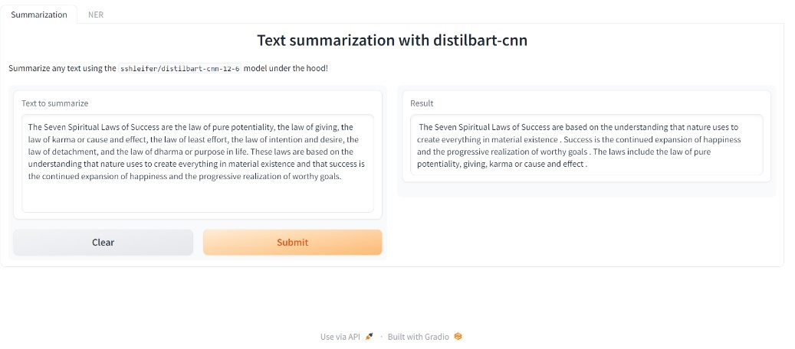
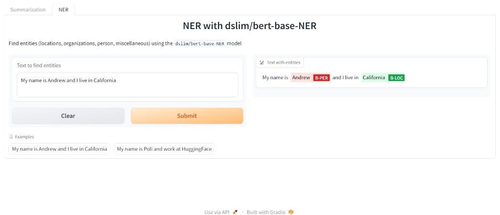

# NLP solutions
Summarization plus NER

## 🤔 What is this?
**Description:**  
NLP solutions with Gradio UI, with 2 NLP functions
 - Summarization with specific transformer model DistilBart
 - NER: Named Entity Recognition, bert-base-NER, recognizes 4 types of entities (name, organization…..)
Both use pipeline (from Huggingface) to "call" the models

## 📚 Data

Pre-trained models in their specific functions: Summarization and NER. No need for fine-tuned.
Data is introduced by users

##  🚀 Quick Install

pip install -r requirements.txt` #install environment.

run python file (NLP_Solutions).
NLP_Solutions.py import Summarization.py and NER.py, and call the 2 functions (Summarization and NER)

## 📖 Documentation / UI

🧮 **Summarizaton UI**: 

 

🧮 **NER UI**: 

 

Please see docs dir for full documentation.

